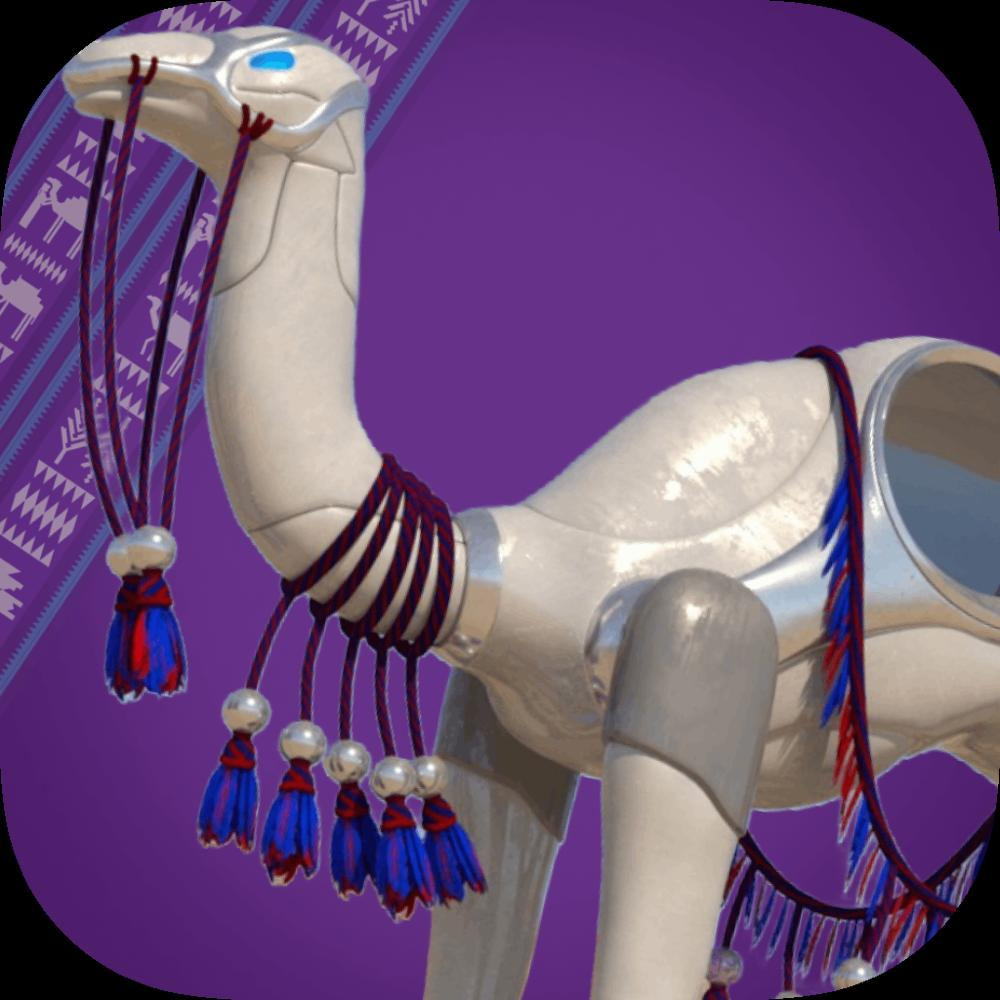
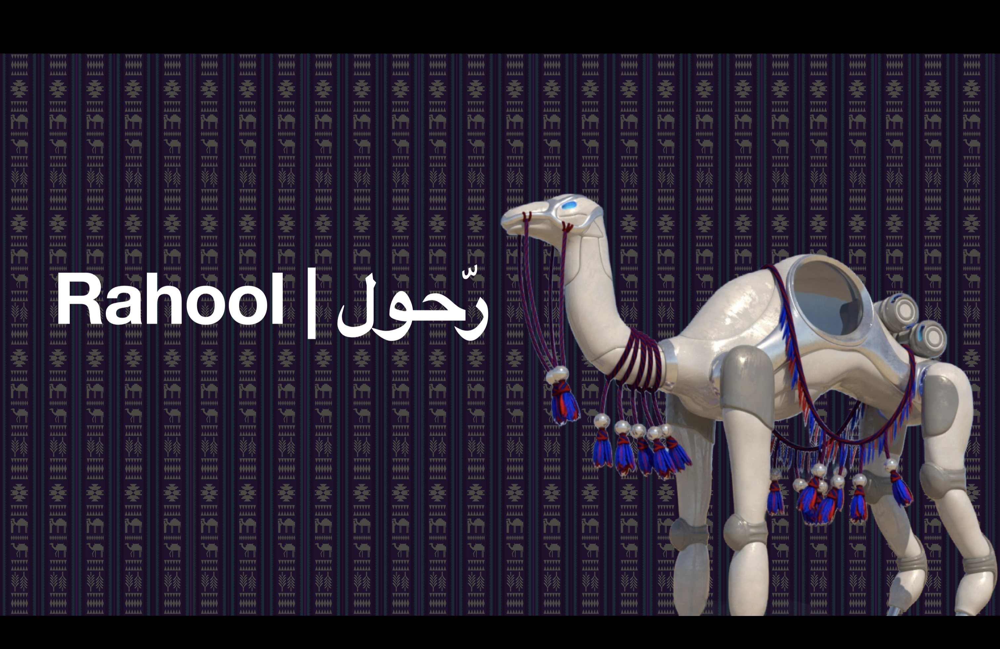
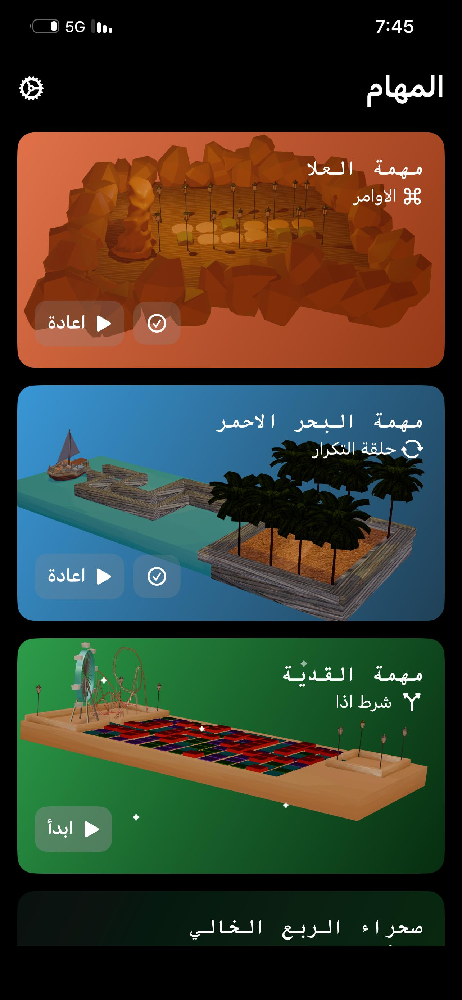
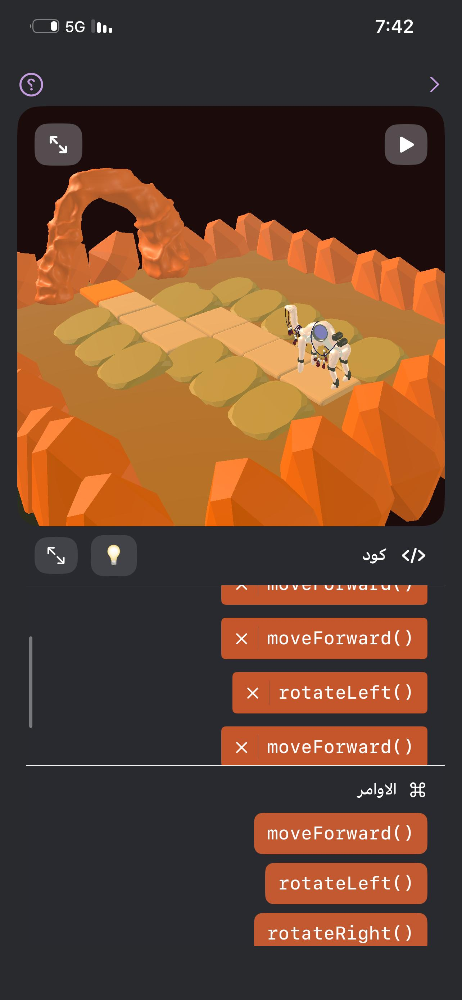
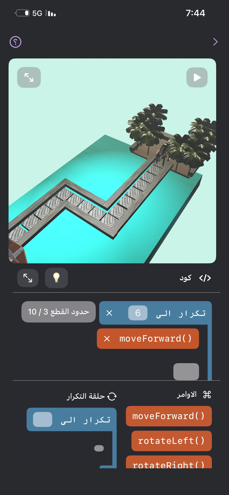
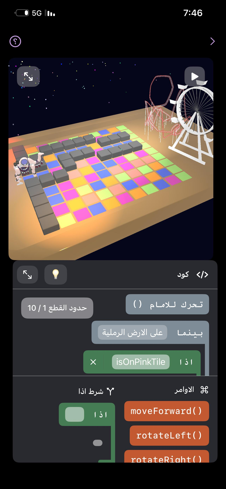
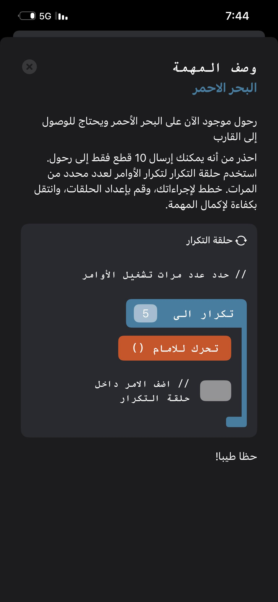

<h1>
	 Rahool
</h1>

Rahool is an interactive coding education application designed to make learning programming more engaging, accessible, and culturally relevant for Arabic-speaking learners.

The app combines block-based coding, gamification, interactive missions, and Saudi-inspired environments to help beginners develop programming logic through exploration and practice.

⸻

## About the Project 💡

Traditional coding education can be challenging for beginners, particularly Arabic-speaking learners due to limited Arabic educational content and the complexity of conventional teaching methods.

Rahool addresses this challenge by providing an immersive learning environment where users can learn programming concepts through interactive missions and culturally relevant experiences inspired by Saudi Arabia.

⸻

## Key Features✨ 

### 🧩 Block-Based Coding
   Simplifies programming concepts and makes coding more accessible for beginners.
### 🎯 Interactive Coding Challenges
  Users complete missions and exercises covering programming concepts such as instructions, conditions, and loops.
### 🗺️ Explorative Learning Environment
  Learners explore virtual representations of Saudi cities, regions, and landmarks while progressing through coding challenges.
### 🇸🇦 Arabic & Cultural Relevance
  Supports Arabic-speaking learners and incorporates elements of Saudi culture into the learning experience.
### 🎮 Gamification
  Badges, challenges, missions, and progression mechanics encourage learners to continue practicing and developing their programming skills.
### 🏜️ The Empty Quarter
   An open environment where learners can practice and experiment with programming concepts they have learned throughout their journey.
### ⚡ Real-Time Feedback
   Provides immediate feedback during coding challenges to help learners identify mistakes and improve their skills.
### 🥽 Immersive Learning
  Rahool expands the traditional mobile learning experience into spatial computing through a version developed for Apple Vision Pro.
⸻

##  App Screenshots 📱

	
	
	
	
	

	
⸻

#  Rahool on Apple Vision Pro 🥽

Rahool goes beyond traditional mobile learning with an immersive experience developed for Apple Vision Pro.

The Vision Pro version brings Rahool’s educational experience into spatial computing, allowing learners to interact with programming concepts and educational content in an immersive AR/VR environment.

## Vision Pro Features

* 🥽 Immersive spatial learning environment
* 🧩 Interactive programming activities
* 🌐 AR/VR-based educational experiences
* 🇸🇦 Saudi-inspired virtual environments
* 🎯 Interactive exploration of programming concepts

## Apple Vision Pro Screenshots

⸻

##  Platform 📲

Rahool is primarily designed as a mobile application for iOS.

The project also includes an immersive experience developed for Apple Vision Pro, extending Rahool into spatial and immersive learning.

Rahool can be used independently for self-paced learning or integrated into educational environments.

⸻

##  Project Impact ! 📊

Rahool has reached:

### 354 organic downloads ⭐
### 4.8/5 rating ⭐

These results reflect early user engagement with Rahool’s approach to interactive programming education.

⸻

##  Future Development🔮

Future versions of Rahool aim to include:

* More advanced programming concepts and challenges
* Additional Saudi regions, landscapes, and landmarks
* Expanded immersive AR/VR experiences
* Collaboration with educational institutions
* Continuous improvements to personalized learning and user engagement

⸻
## App Store

